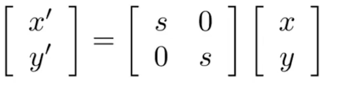
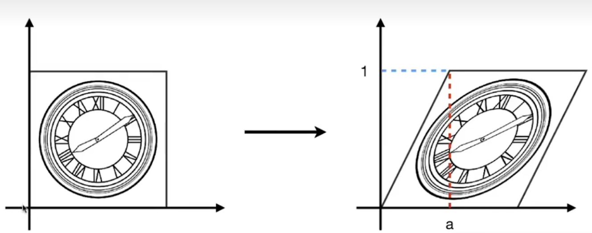
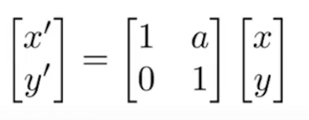
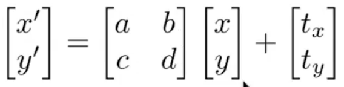
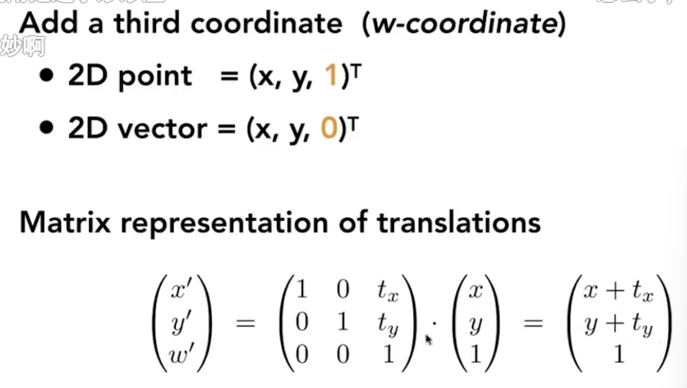
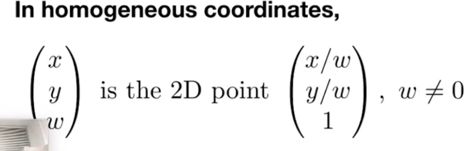
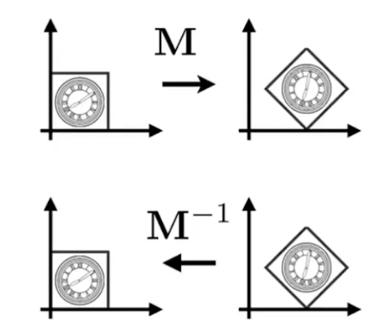
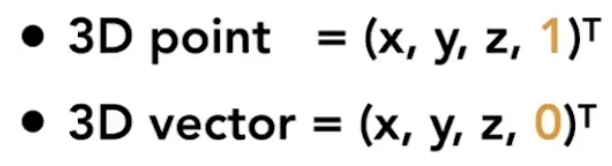

# Lecture 03 Tranformation

## 1 Why study transformation？

- modeling
  - scale
- Viewing : projection(3D to 2D)

## 2 2D transformation: rotation, scale, shear

- scale 
  - 

- horizontal reflection

  - horizontal shift
    - vertical shift is always 0
    - 
    - 

- rotation

- linear transforms = matrices

  

## 3 Homogeneous cooridnates

- translation
  - 
  - translation is not linear transform!
- 
- 向量为0：平移不变性
- 
- affine transform $\rightarrow$ using homogenous cooridnate
- Inverse transform
  - 
  - $AA^{-1}=I$
- the order of transforms is import 
  - it means the product don't meet  Exchange law

## 4 Composing transforms

- composing transforms
- decomposing complex transforms

## 5 3D transformations

- 
- 