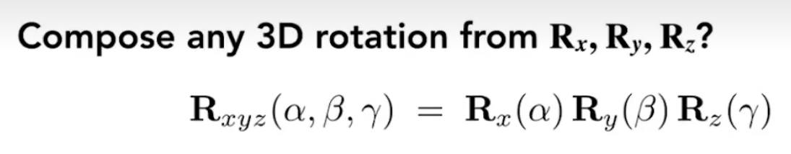
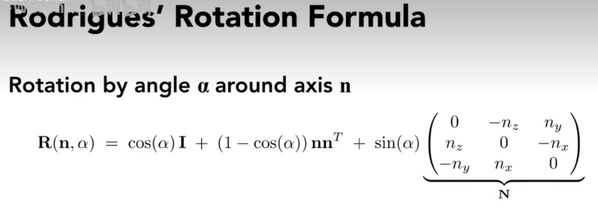
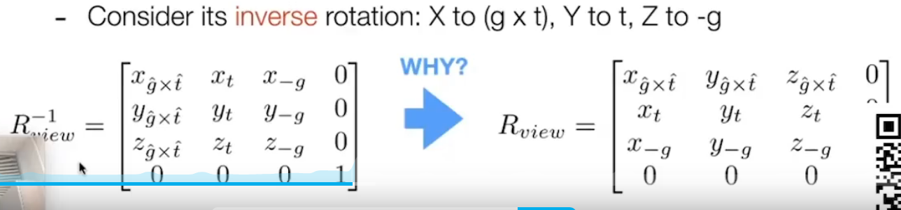
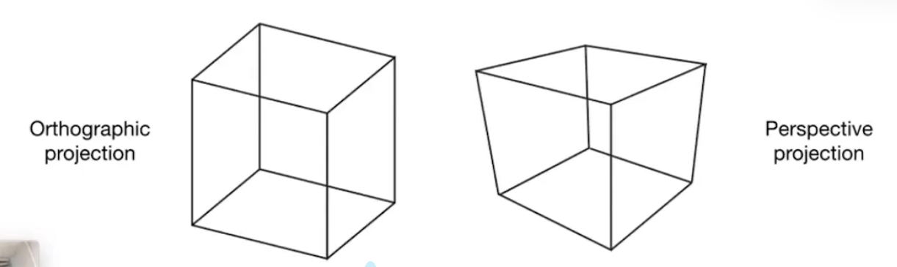

# Lecture 04 Transformation Cont.

## 1 3D Transformations

- 
- 

## 2 Viewing transformation

- view / camera transformation
  - camera to origin 
  - 
  - 旋转矩阵是正交矩阵，正交矩阵的逆就是他的转置
- projection transformation
  - 
  - 